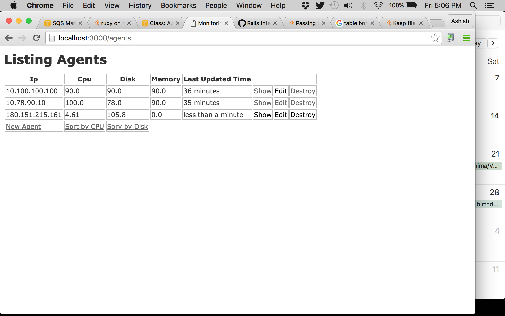

## Monitoring Server ##

This a Rails 4 app that largely stores monitoring data sent to it by agents. 

### Running the app ###

1. Setup this app as regular Rails app. git clone, bundle install, rake db:migrate etc.

2. Run rails app. Navigate to localhost:3000 to view list of agents (will be empty to start with).

3. Navigate to agent app. Follow the instructions to set it up. It will start pushing data to the Amazon queue.

4. Copy `shoryken-worker.example` to `shoryuken-worker`. Populate Amazon key & secret. It is needed to read the data from the queue. Run the command mentioned in the file or just run the file as ./shoryken-worker (unix systems). Logs are genereated in log/shoryuken.log 

5. Refresh localhost:3000 to view the agents & the data.

### Architecture ###

1. *Agent Data Storage Layer* - There is a background worker `app/workers/agent_worker.rb` that keeps reading data from Amazon Queue. All agents are suppose to push data into the queue. I have used `shoryken` gem which creates 10 odd workers to be able to read data from the queue in an async way.

2. *Reporting Layer* - The rails app is the reporting layer that shows the agents & the data. Provision created to sort the agents based on cpu & disk usage. `agent` is a resource & options to edit a agent data or create new agent is also present just for testing purpose. 

### Dint-Do / Sub-optimalities ###

1. *Sqlite DB & not Nosql* - I dint have time to include DynamoDB & I used the regular DB that comes with the Rails app just because of lack of time in hand

2. *Webrick server & not Phusion Passenger* - I have not worked with Phusion Passenger. Earlier I had used Unicorn to deploy my rails app. I am sure Phusion is a straight forward thing but I dint have time. With the worker being *scalable*, the app can be deployed on production even with very basic webrick server because the reporting structure is not going to be as critical as the data storage layer. 

3. *No tests* - I usually write functional tests (not unit tests). The only 2 flows that needed testing here is testing the worker & testing the sorting feature. If I have time in hand, I will send over the test. This is imp & I understand that.
